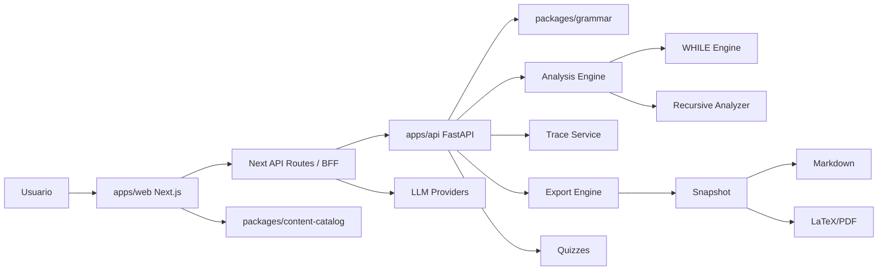

# Arquitectura del sistema

**Tipo:** descriptiva
**Estado:** final
**Audiencia:** dev
**Fuente de verdad:** `apps/web/`, `apps/api/`, `packages/*`, `pnpm-workspace.yaml`
**Última revisión:** 2026-05-18
**Relacionado con informe técnico:** vistas generales, interacción entre capas, decisiones de diseño

## Propósito

Explicar la arquitectura de extremo a extremo de AALIE, ubicar responsabilidades por capa y documentar las decisiones de diseño que gobiernan el sistema.

## Alcance

Cubre monorepo completo (3 apps, 4 packages), frontend Next.js, backend FastAPI, paquetes compartidos, export pipeline, integración LLM, quizzes, CI y documentación.

## Fuera de alcance

Detalle interno de cada analizador (ver `analysis-engine-overview.md`), esquema de snapshot (ver `report-snapshot-spec.md`).

## Contenido

### Monorepo

| Capa | Directorio | Rol |
|---|---|---|
| Frontend + BFF | `apps/web` | Next.js 14.2 App Router, UI, i18n, BFF proxy |
| Backend | `apps/api` | FastAPI, parseo, clasificación, análisis, trace, export, quizzes, LLM |
| Gramática | `packages/grammar` | ANTLR4 .g4, codegen TS+Python, AST builders |
| Tipos | `packages/types` | Tipos compartidos TS: AST, análisis, trace, LLM, quiz, snapshot |
| Catálogo | `packages/content-catalog` | JSON schemas, validación, carga, búsqueda, progreso |
| Contenido | `packages/content-data` | Bancos de quizzes JSON |
| Docs | `docs/` | Specs, arquitectura, operación, ADRs |
| Infra | `infra/` | Docker Compose, soporte de entorno |

### Mermaid: flujo principal



### Pipeline principal

```
pseudocódigo → parse (ANTLR) → AST → classify → analyze → trace → snapshot → render UI / export
```

1. El usuario escribe pseudocódigo en Monaco Editor
2. Validación sintáctica local (ANTLR TS) + servidor-side fallback
3. BFF envía a backend FastAPI para parseo a AST
4. Clasificador determina tipo: `iterative`, `recursive`, `hybrid`, `while`
5. Analysis Engine selecciona analizador según tipo (AnalyzerRegistry)
6. Ejecuta análisis: by-line costs → sumatorias → T_open → O/Ω/Θ
7. Trace ejecuta con inputs concretos para visualización paso a paso
8. Export construye snapshot inmutable → renderiza a Markdown/LaTeX/PDF/ZIP
9. UI renderiza resultados con KaTeX, React Flow, tablas

### Web layer

- **Next.js 14.2 App Router** con rutas localizadas `/{locale}/...`
- **i18n**: `next-intl`, locales `es`/`en`
- **Monaco Editor** con autocompletado contextual bilingüe
- **React Flow** para árboles de recursión y diagramas de trace
- **KaTeX** para fórmulas matemáticas
- **12 rutas BFF** que actúan como proxy hacia backend FastAPI
- Estado local: `sessionStorage` para análisis actual, `localStorage` para API key y progreso quizzes

### API layer

- **FastAPI** con 6 routers montados en main.py
- 17 endpoints totales (15 únicos + 2 alias backward-compat)
- Sin middleware de autenticación — rutas públicas
- CORS configurable por entorno

### Grammar package

- `grammar/Language.g4` — definición ANTLR4 del lenguaje de pseudocódigo
- Codegen dual: `gen-ts.js` → TypeScript parser (web), `gen-py.js` → Python parser (API)
- AST builders en TS (`ast-builder.ts`)
- Fixtures `.pseudo` para tests

### Types package

- `src/index.ts`: AST nodes, análisis (byLine, T_open, O/Ω/Θ, recurrencias), trace (ExecutionStepCanonical, CallTreeCanonical), LLM, snapshot
- `src/export-snapshot.ts`: snapshot schema version `1.0.0`, tipos `SnapshotSection<T>`, `AalieAnalysisSnapshotV1`
- `src/quiz.ts`: dominio de quizzes (question, session, attempt, grading, selection)
- `src/content.ts`: ContentRef, RenderableBlock

### Content catalog

- JSON Schema en `schemas/`: `shared.schema.json`, `space.schema.json`, `module.schema.json`, `block.schema.json`, `inline.schema.json`
- Catálogo en `catalog/spaces/`: `course/` y `user-guide/` con módulos por locale
- Tipos de bloque: 27+ tipos (heading, paragraph, code, equation, mermaid, recursionTree, graph, complexityTable, etc.)
- Validación: `validate.ts` contra JSON schemas

### Export pipeline

1. `build_export_state()` → orquesta parseo, clasificación, análisis, trace
2. `SnapshotBuilder` → construye `AalieAnalysisSnapshotV1` versión `1.0.0`
3. `DocumentModel` → transforma snapshot en modelo de documento estructurado
4. `MarkdownRenderer` / `LaTeXRenderer` → renderizan a formato textual
5. Opcional: `LaTeXCompiler` → `pdflatex` → PDF
6. `ZipBundle` → empaqueta reporte + `snapshot.json` + `manifest.json`
7. Assets: `trace_diagram.py` genera diagramas de trace como imágenes

### LLM integration

- Subsistema **opcional** — no afecta el motor determinista
- Proveedores: Gemini (default), OpenAI-compatible
- 5 jobs: `general`, `repair`, `compare`, `explain`, `parser_assist`
- Config: `API_KEY`, `GEMINI_ENDPOINT_BASE`, modelos por job
- BFF proxy en `/api/llm/*` — el backend es el único punto autorizado para hablar con proveedores

### Quizzes system

- Banco JSON en `packages/content-data/quizzes/ada-quiz-bank.json` (es/en)
- 6 backend endpoints + 4 BFF endpoints
- Selección adaptativa determinista por dificultad, tópico, habilidades
- 5 políticas de calificación: `all_or_nothing`, `exact_set`, `partial_credit`, `ordered_exact`, `pairwise`
- Progreso en localStorage del navegador

### CI / Docs validation

- GitHub Actions: 8 jobs (build, PR tests, coverage gate 70%, lint, docs validation, quizzes validation, Docker, nightly)
- `pnpm validate:content-catalog` — validación de schemas
- `pnpm test:api:cov` — coverage con pytest
- Documentación contractual en `docs/03-specs/`

## Evidencia desde código o configuración

- Router mounts en `apps/api/app/main.py:60-65`
- BFF routes en 12 archivos bajo `apps/web/src/app/api/`
- Snapshot schema version en `packages/types/src/export-snapshot.ts:10`
- AnalyzerRegistry en `apps/api/app/modules/analysis/analyzers/registry.py:9-13`
- Quiz grading policies en `apps/api/app/modules/quizzes/grading.py:20-58`
- While engine patterns en `apps/api/app/modules/analysis/while_engine/engine.py:91-104`
- CI workflow en `.github/workflows/ci.yaml`

## Limitaciones

- Sin middleware de autenticación — todas las rutas API son públicas
- PDF requiere `pdflatex` en runtime del servidor
- LLM depende de API key externa
- Los bancos de quizzes dependen de curaduría continua
- El analysis engine no usa IA como fuente de verdad — es determinista

## Archivos relacionados

- `frontend-architecture.md`
- `backend-architecture.md`
- `package-architecture.md`
- `data-flow.md`
- `uml-diagrams.md`
- `design-patterns.md`
- `analysis-engine-overview.md`
