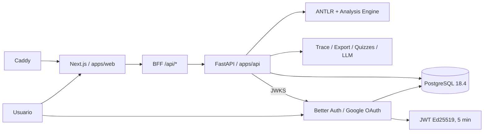

# Arquitectura del sistema

**Tipo:** descriptiva  
**Estado:** final  
**Audiencia:** dev  
**Fuente de verdad:** `apps/web/`, `apps/api/`, `packages/*`, `infra/`  
**Última revisión:** 2026-08-20  
**Relacionado con informe técnico:** vistas generales, interacción entre capas, decisiones de diseño

## Propósito

Explicar la arquitectura de extremo a extremo de AALIE, ubicar responsabilidades por capa y documentar las decisiones de diseño que gobiernan el sistema desplegado.

## Alcance

Cubre frontend Next.js, BFF, autenticación opcional, backend FastAPI, PostgreSQL, paquetes compartidos, análisis, trace, export, quizzes, LLM, CI y topología OCI.

## Monorepo

| Capa | Directorio | Rol |
|---|---|---|
| Frontend + BFF + auth | `apps/web` | Next.js 15.5 App Router, React 19, UI, i18n, BFF y Better Auth |
| Backend | `apps/api` | FastAPI, parseo, clasificación, análisis, trace, export, quizzes, LLM y validación JWT |
| Gramática | `packages/grammar` | ANTLR4, codegen TypeScript/Python y AST builders |
| Tipos | `packages/types` | Tipos compartidos de AST, análisis, trace, quiz y snapshot |
| Catálogo | `packages/content-catalog` | Schemas JSON, validación, carga y búsqueda de contenido |
| Contenido | `packages/content-data` | Bancos de quizzes y datos pedagógicos versionados |
| Docs | `docs/` | Especificaciones, arquitectura, operación y ADRs |
| Infra | `infra/` | Docker Compose local/productivo y despliegue OCI |

## Vista de alto nivel



En producción, Caddy es el único servicio expuesto en `80/443`. `web`, `api` y `postgres` comparten la red privada de Compose; API y PostgreSQL no publican puertos al host.

## Pipeline pedagógico principal

```text
pseudocódigo → parse → AST → classify → analyze → trace → snapshot → UI / export
```

1. El usuario escribe pseudocódigo en Monaco.
2. El frontend puede validar sintaxis localmente con ANTLR TypeScript.
3. El BFF envía la solicitud canónica a FastAPI.
4. FastAPI parsea y clasifica el algoritmo.
5. El motor determinista selecciona el analizador correspondiente.
6. Se calculan costos por línea, expresiones cerradas y clases asintóticas.
7. Trace puede ejecutar el algoritmo con entradas concretas.
8. Export construye un snapshot único e inmutable y lo renderiza a Markdown/LaTeX/PDF/ZIP.
9. La UI presenta resultados con KaTeX, tablas y grafos.

El subsistema LLM es opcional y no sustituye al motor determinista como fuente de verdad.

## Frontend y BFF

- **Next.js 15.5.21**, React 19.2.6 y TypeScript 5.5.4.
- App Router con rutas localizadas mediante `next-intl`.
- Monaco para edición, KaTeX para matemáticas y React Flow para visualizaciones.
- BFF mismo-origen para evitar que el navegador dependa de la dirección interna de FastAPI.
- Better Auth 1.7.1 vive en el runtime Node del frontend y usa PostgreSQL directamente mediante `pg`.
- La autenticación es opcional: el análisis, trace, export, contenido y quizzes existentes continúan disponibles para usuarios anónimos en esta fase.
- `/api/auth/[...all]` expone el contrato Better Auth; `/{locale}/profile` presenta el estado de identidad del usuario autenticado.

## Backend FastAPI

FastAPI monta siete routers funcionales: parsing, analysis, auth, classification, LLM, export y quizzes.

Las rutas pedagógicas existentes continúan públicas. El router `/auth` demuestra la frontera autenticada:

- `GET /auth/whoami`: requiere un bearer JWT válido.
- `GET /auth/admin/ping`: además requiere `role=ADMIN`.

No existe middleware global que convierta todo FastAPI en privado. La protección se declara mediante dependencias (`get_identity`, `require_admin`) en las rutas que realmente la necesitan.

## Identidad y autenticación

### Google OAuth y Better Auth

- Proveedor de login: Google OAuth.
- No se implementan contraseñas locales, magic links ni GitHub OAuth.
- Los usuarios viven en el schema PostgreSQL `auth`.
- Roles operativos soportados: `USER | ADMIN`.
- El campo `role` es server-owned, con `USER` como valor por defecto.
- La promoción inicial a `ADMIN` es una operación explícita del operador; no depende del email ni de datos enviados por el cliente.
- Los tokens OAuth persistidos por Better Auth se cifran mediante `account.encryptOAuthTokens`.
- Las sesiones persistentes duran siete días y no usan `cookieCache` en esta configuración.

### Frontera JWT hacia FastAPI

Better Auth emite JWT Ed25519 de vida corta para la frontera de servicio:

- algoritmo: `EdDSA` / curva `Ed25519`;
- expiración: 5 minutos;
- `iss` y `aud` configurados por entorno;
- `sub = user.id`;
- payload adicional mínimo: `role`.

FastAPI valida firma, `kid`, JWKS, `iss`, `aud`, `exp`, `sub` y que `role` pertenezca a `USER | ADMIN`. El JWKS se consulta por la red interna hacia `web` y se mantiene en una caché acotada con refresh controlado.

La disponibilidad de JWKS no forma parte de `/health/ready`; así se evita crear una dependencia circular de arranque `web → api → web`.

## PostgreSQL y migraciones

- PostgreSQL 18.4 self-hosted en la misma VM OCI.
- Imagen oficial fijada por tag y digest.
- Sin puerto `5432` publicado al host.
- Volumen persistente en `/var/lib/postgresql`.
- Alembic es el único mecanismo de migración de producción.
- Schema `auth`: Better Auth + JWKS.
- Schema `public`: reservado para dominio AALIE y futuras tablas académicas.
- No se usa `Base.metadata.create_all()` en runtime.
- El deploy ejecuta `alembic upgrade head` antes de levantar API/web.
- El rollback revierte imágenes, no hace downgrade automático del esquema; las migraciones deben ser forward-compatible con la imagen anterior.

## Estado local y persistencia pedagógica

En esta fase, la existencia de PostgreSQL y autenticación no cambia todavía la fuente de verdad del progreso pedagógico:

- `sessionStorage`: análisis actual y estado efímero relacionado.
- `localStorage`: progreso de quizzes/contenido y otros estados locales existentes.
- PostgreSQL: identidad, sesiones, material de autenticación y base para persistencia futura.

La sincronización académica cross-device pertenece a una microfase posterior.

## Investigación y condición experimental

La identidad operacional y la identidad experimental son conceptos separados:

- `USER | ADMIN` son roles de autorización de producto.
- `AALIE | CONTROL` será una condición de estudio, no un rol.
- Iniciar sesión no inscribe automáticamente a una persona en un estudio ni constituye consentimiento de investigación.
- La futura instrumentación debe usar identificadores seudónimos de participante y evitar usar email como clave del dataset académico.

Estas estructuras todavía no se crean en la Microfase 2.

## Export pipeline

1. `build_export_state()` orquesta parseo, clasificación, análisis y trace.
2. `SnapshotBuilder` construye `AalieAnalysisSnapshotV1`.
3. `DocumentModel` transforma snapshot a documento estructurado.
4. Renderers generan Markdown o LaTeX.
5. `LaTeXCompiler` puede invocar `pdflatex` para PDF.
6. ZIP empaqueta reporte, snapshot y manifiesto.

El snapshot es la única fuente de verdad de los exportables; no se recalcula el análisis durante el render.

## Quizzes y contenido

- Banco de preguntas versionado en `packages/content-data`.
- Selección y grading deterministas.
- El contenido modular se valida mediante JSON Schema.
- El progreso sigue en almacenamiento local durante esta fase.

## CI y producción

Los gates del repositorio validan, entre otros:

- build y tests web;
- lint/format frontend y Ruff backend;
- migraciones Alembic;
- cobertura rápida del backend con umbral mínimo de 70%;
- lanes `contract + system`;
- contratos OCI;
- Docker E2E productivo;
- build/smoke nativo ARM64;
- persistencia, backup/restore PostgreSQL;
- JWKS/auth smoke y shutdown limpio.

## Limitaciones actuales

- Las rutas pedagógicas de FastAPI siguen públicas; el rate limiting por feature todavía no se implementa.
- Better Auth aplica únicamente límites propios al subsistema de autenticación.
- No existen todavía `studies`, `study_participants`, `study_measurements` ni telemetría académica persistente.
- El progreso pedagógico todavía no se sincroniza server-side.
- PDF requiere `pdflatex` en runtime.
- LLM depende de proveedor/API key y no constituye la fuente de verdad del análisis.

## Archivos relacionados

- `backend-architecture.md`
- `frontend-architecture.md`
- `data-flow.md`
- `../09-decisions/adr-017-postgresql-self-hosted-oci.md`
- `../09-decisions/adr-018-google-oauth-better-auth-jwt.md`
