# Diagramas UML

**Tipo:** descriptiva
**Estado:** final
**Audiencia:** dev
**Fuente de verdad:** `apps/`, `packages/`, `docs/02-architecture/*.md`
**Última revisión:** 2026-05-18
**Relacionado con informe técnico:** visualización de componentes, secuencias, dependencias

## Propósito

Proporcionar diagramas Mermaid conceptuales que describen la estructura de paquetes, jerarquía de clases y secuencias de interacción entre componentes.

## Alcance

Cubre paquetes del monorepo, jerarquía de analizadores, modelo de export, dominio de quizzes y 8 secuencias de interacción.

## Nota

Todos los diagramas son **conceptuales** — representan relaciones arquitectónicas, no mapeo exacto 1:1 con clases del código.

## Contenido

### 1. Package diagram — dependencias del monorepo

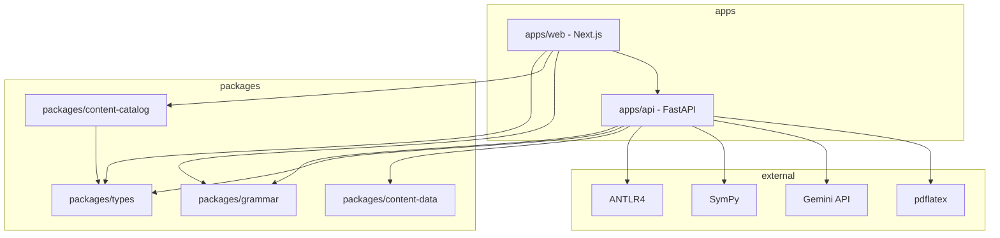

### 2. Class diagram (conceptual) — Analyzer hierarchy

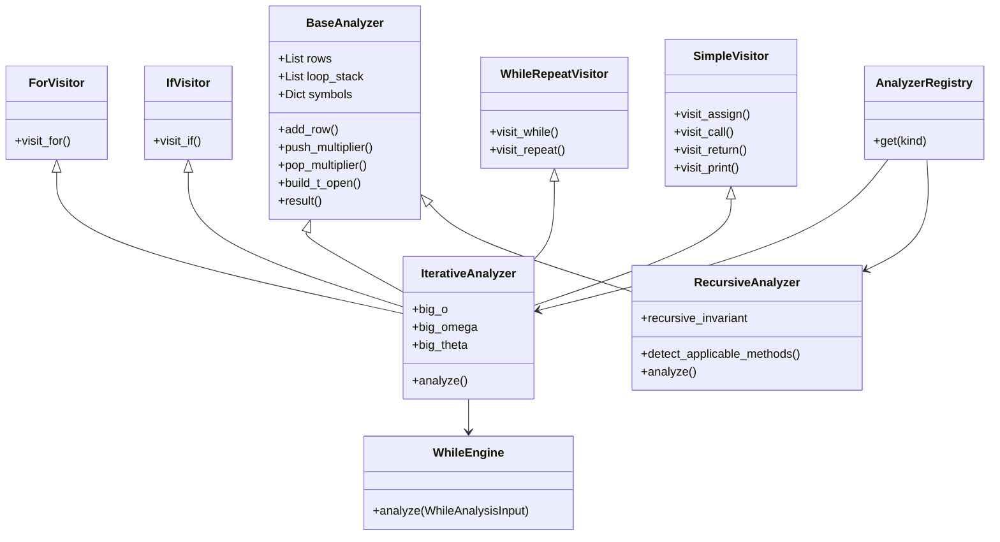

### 2b. Class diagram (conceptual) — AST nodes

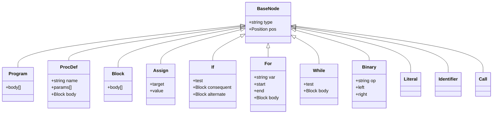

### 2c. Class diagram (conceptual) — Export document model

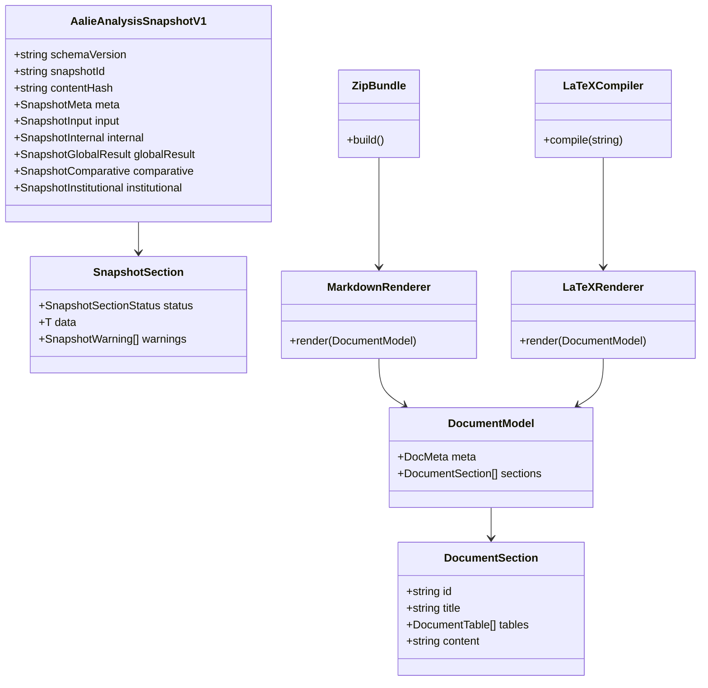

### 2d. Class diagram (conceptual) — Quiz domain

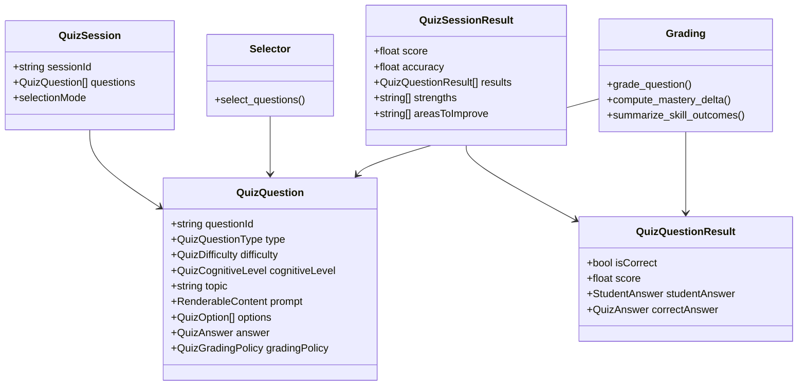

### 3. Sequence — Parse

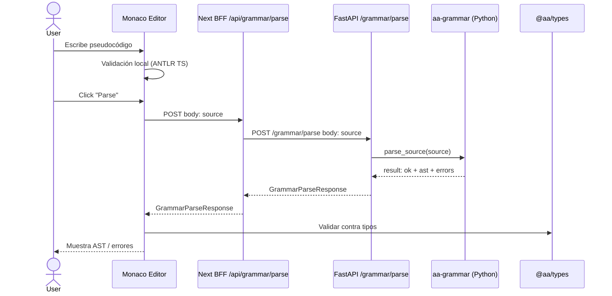

### 4. Sequence — Iterative Analysis

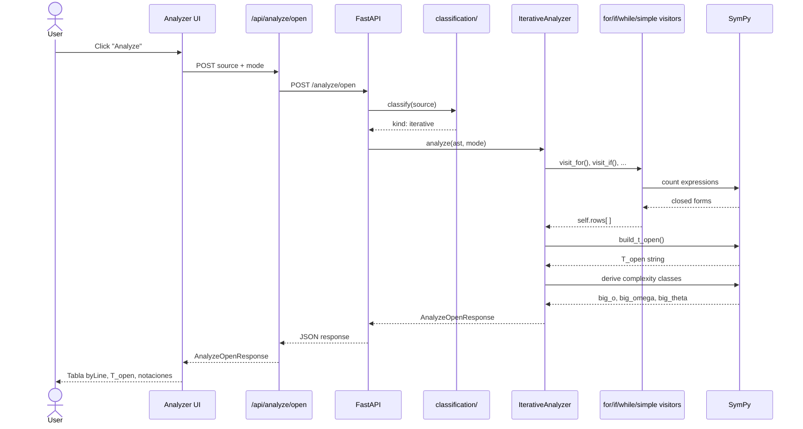

### 5. Sequence — Recursive Analysis

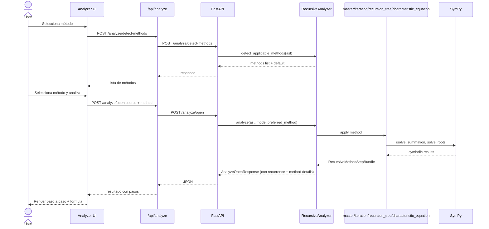

### 6. Sequence — Trace

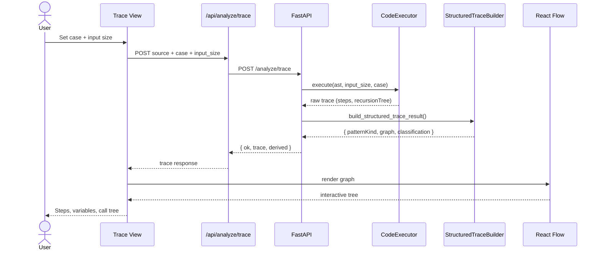

### 7. Sequence — Export

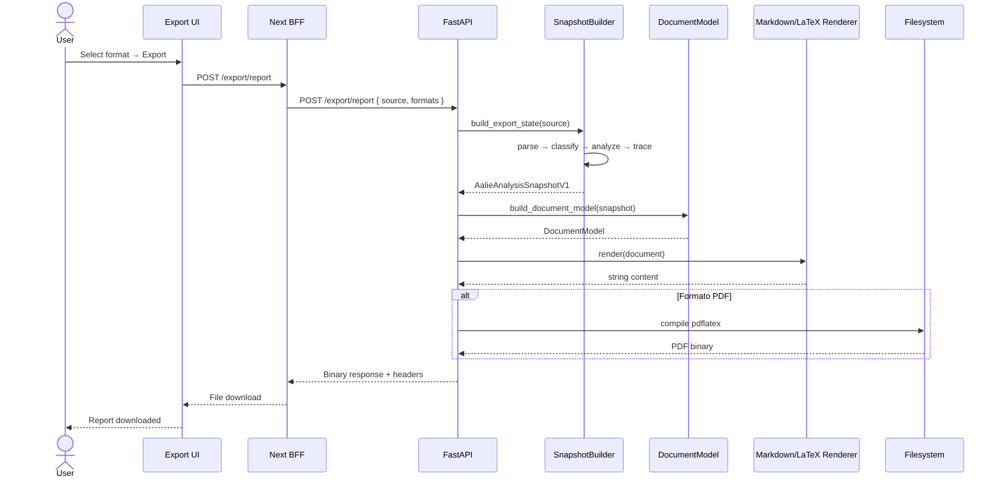

### 8. Sequence — Quiz

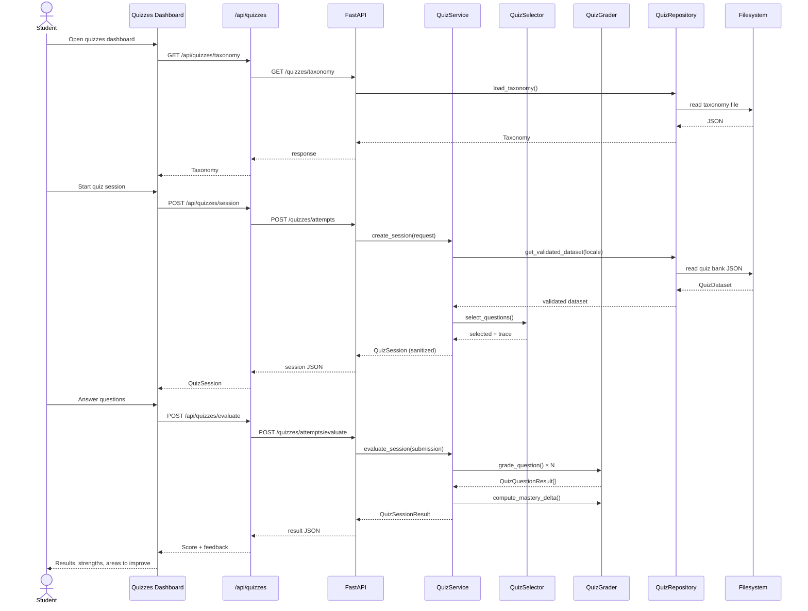

### 9. Sequence — LLM

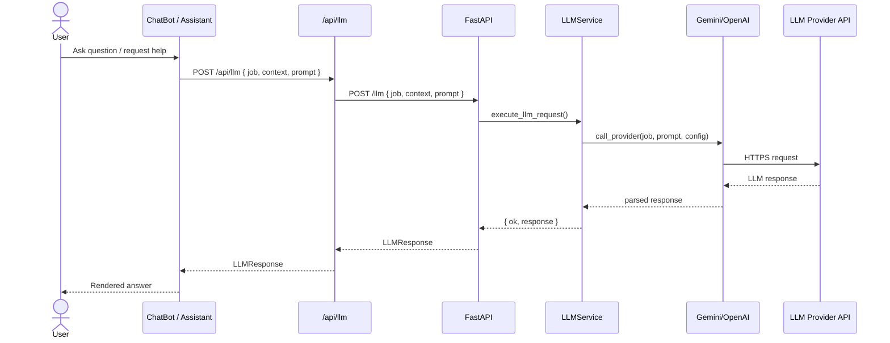

## Archivos relacionados

- `system-architecture.md`
- `backend-architecture.md`
- `data-flow.md`
- `design-patterns.md`
