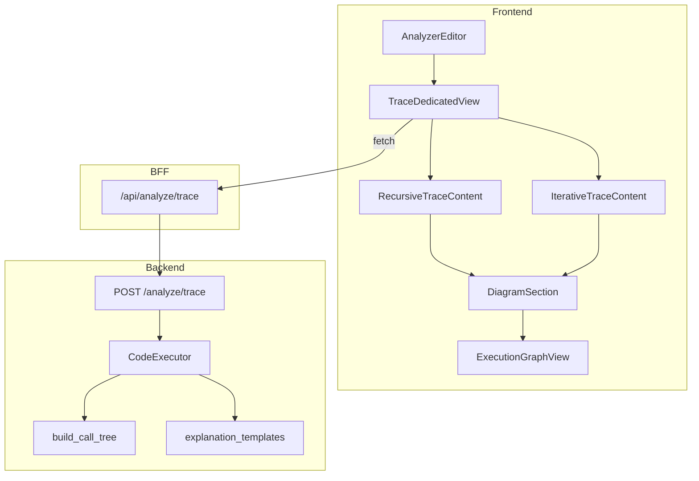
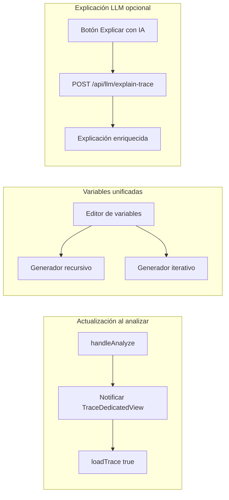

# Informe de Implementación del Sistema de Trace

**Versión:** 1.0  
**Fecha:** Marzo 2025  
**Autor:** AALIE

---

## 1. Resumen Ejecutivo

El sistema de trace (seguimiento de ejecución) permite visualizar la ejecución paso a paso de algoritmos en pseudocódigo, tanto iterativos como recursivos. Incluye diagramas deterministas (sin LLM), árbol de llamadas recursivas, tokens heurísticos, explicaciones por plantillas y persistencia en cache.

---

## 2. Arquitectura Actual

### 2.1 Flujo de Datos



### 2.2 Componentes Principales

| Componente | Ubicación | Responsabilidad |
|------------|-----------|-----------------|
| `TraceDedicatedView` | `apps/web/src/components/TraceDedicatedView.tsx` | Vista principal, carga trace, cache, routing |
| `RecursiveTraceContent` | `apps/web/src/components/trace/RecursiveTraceContent.tsx` | Contenido recursivo: diagrama, explicación, controles |
| `IterativeTraceContent` | `apps/web/src/components/trace/IterativeTraceContent.tsx` | Contenido iterativo: pasos, diagrama, variables |
| `DiagramSection` | `apps/web/src/components/trace/DiagramSection.tsx` | Sección de diagrama con botones recargar/expandir |
| `ExecutionGraphView` | `apps/web/src/components/ExecutionGraphView.tsx` | Renderizado React Flow del grafo |
| `CodeExecutor` | `apps/api/app/modules/execution/executor.py` | Ejecución del AST y generación de steps |
| `build_call_tree` | `apps/api/app/modules/execution/call_tree_builder.py` | Construcción del grafo del árbol de llamadas |
| `explain_recursion_tree` | `apps/api/app/modules/execution/explanation_templates.py` | Explicación determinista del árbol recursivo |

### 2.3 Endpoint de Trace

**POST** `/api/analyze/trace` (BFF) → **POST** `{API_BASE}/analyze/trace` (backend)

**Request:**
```json
{
  "source": "código pseudocódigo",
  "case": "worst" | "best" | "avg",
  "input_size": 4,
  "initial_variables": { "A": [1,2,3,4], "x": 4 } | null,
  "locale": "es" | "en",
  "include_execution_diagram": true,
  "include_call_tree": true
}
```

**Response:**
```json
{
  "ok": true,
  "trace": { "steps": [...], "recursionTree": { "calls": [...], "root_calls": [...] } },
  "algorithmKind": "iterative" | "recursive" | "hybrid" | "unknown",
  "executionDiagram": { "graph": {...}, "diagramKind": "execution_diagram" },
  "callTree": { "graph": {...}, "diagramKind": "call_tree", "explanation": "..." }
}
```

---

## 3. Funcionalidades Implementadas

### 3.1 Trace Iterativo

- **Pasos:** Navegación paso a paso con `StepControls` (play, pause, next, prev).
- **Variables:** Panel `VariablesPanel` con variables iniciales y finales.
- **Diagrama:** `build_execution_diagram` genera grafo de flujo desde steps.
- **Input generator:** Heurística por caso (best/avg/worst) con `A`, `x`, `n` según patrón del código.

### 3.2 Trace Recursivo

- **Árbol de llamadas:** `build_call_tree` desde `recursionTree.calls`.
- **Formato de nodos:** `funcion(a, b, c)` (valores en orden, sin nombres de parámetros).
- **Tokens y microsegundos:** Suma por `callId` desde steps; se muestran en cada nodo.
- **Retornos:** `→ valor` en el label cuando `return_value` está definido.
- **Explicación:** `explain_recursion_tree` genera texto determinista (resumen + steps call_enter/return_emit).

### 3.3 UX

- **Cache:** `sessionStorage` con TTL 5 min; clave `source:scenario:n`.
- **Botón recargar:** `loadTrace(true)` invalida cache y hace refetch.
- **Layout call tree:** `traceGraphLayout` detecta nodos `call_*` y usa `nodeHeight=80`, `nodesep=100`, `ranksep=140`.

### 3.4 Integración con el Analyzer

- **Vista trace:** Se activa con el botón "Ver seguimiento" (requiere `hasComparableData` y `hasApiKey`).
- **Montaje:** `TraceDedicatedView` se monta al abrir la vista y persiste al volver.
- **Datos:** El trace se obtiene exclusivamente de `/api/analyze/trace`; no comparte estado con el análisis de complejidad.

---

## 4. Limitaciones Actuales

### 4.1 Variables de Entrada para Recursivos

- **Iterativo:** `traceConfig.inputGenerator` genera `A`, `x` según caso y `n`.
- **Recursivo:** No hay `inputGenerator`; se envía `initial_variables: null` salvo que el usuario las defina manualmente.
- **Consecuencia:** Algoritmos como `buscarLista(nodo, valor)` requieren `A` y `x` para construir la lista enlazada; si no se pasan, el backend usa heurística (`_map_procedure_params`) que puede fallar.

### 4.2 Cobertura de Algoritmos Recursivos

- **Soportados:** Procedimientos con llamada recursiva directa (factorial, Fibonacci, búsqueda binaria, buscarLista con listas enlazadas).
- **Limitaciones:** Recursión indirecta, múltiples procedimientos recursivos, estructuras de datos complejas (árboles con izq/der) pueden no generar `recursionTree` correctamente.
- **Documentación:** Ver [docs/recursion-tree-edge-cases.md](recursion-tree-edge-cases.md).

### 4.3 Actualización del Diagrama

- El diagrama se actualiza cuando el usuario cambia a la vista trace (loadTrace se ejecuta).
- Si el usuario está en vista trace, edita el código y vuelve a analizar en la vista análisis, al regresar a trace el `useEffect` depende de `source` y debería recargar.
- **Problema potencial:** Si `loadedParamsRef` o la lógica de cache impiden la recarga en ciertos escenarios, el diagrama podría quedar desactualizado sin reiniciar la página.

### 4.4 Explicación

- Actualmente 100% determinista (plantillas).
- No hay fallback con LLM cuando la explicación está vacía o es insuficiente.

---

## 5. Mejoras Propuestas

### 5.1 Actualización del Diagrama al Analizar

**Problema:** El diagrama no se actualiza automáticamente cuando el usuario analiza el algoritmo sin cambiar de vista.

**Propuesta:**
- Al finalizar `handleAnalyze` con éxito, si `analyzerViewMode === "trace"`, invocar `loadTrace(true)` (o exponer un callback desde `TraceDedicatedView`).
- Alternativa: Suscribir la vista trace a un evento/contexto "analysisComplete" que dispare la recarga.
- Objetivo: Evitar que el usuario tenga que recargar la página o cambiar de vista para ver el diagrama actualizado.

**Archivos a modificar:**
- `apps/web/src/app/[locale]/analyzer/page.tsx`: Tras `setIsAnalysisComplete(true)`, si la vista trace está activa, notificar a `TraceDedicatedView`.
- `apps/web/src/components/TraceDedicatedView.tsx`: Exponer `refreshTrace` vía `useImperativeHandle` o callback `onAnalysisComplete` desde el padre.

---

### 5.2 Cobertura de TODOS los Algoritmos Recursivos

**Problema:** Algunos patrones recursivos no generan `recursionTree` o fallan en la ejecución.

**Propuesta:**
1. **Recursión indirecta:** Detectar cadenas A→B→A y registrar llamadas en un grafo unificado.
2. **Múltiples procedimientos:** Soportar varios ProcDef recursivos y construir un call tree que los integre.
3. **Estructuras complejas:** Extender `_map_procedure_params` para árboles binarios (raiz, izq, der) desde estructuras JSON o arrays.
4. **Tests de regresión:** Añadir tests para merge sort, quicksort, Hanoi, generación de subconjuntos (ver [recursion-tree-edge-cases.md](recursion-tree-edge-cases.md)).

**Archivos a modificar:**
- `apps/api/app/modules/execution/executor.py`: `_is_recursive_procedure`, `_execute_procedure`, `_map_procedure_params`.
- `apps/api/app/modules/execution/trace_builder.py`: Soporte para múltiples raíces y procedimientos.
- `apps/api/tests/`: Nuevos tests de sistema para cada patrón.

---

### 5.3 Compatibilidad de Tabulación de Variables de Entrada

**Problema:** Las variables de entrada no son editables ni consistentes entre iterativo y recursivo.

**Propuesta:**
1. **Panel unificado:** Un único `VariablesPanel` o `InputVariablesEditor` que permita editar `A`, `x`, `n`, etc., tanto para iterativo como recursivo.
2. **Generador para recursivos:** Añadir `inputGenerator` al `traceConfig` recursivo, inferido desde los parámetros del procedimiento (ej. si hay `nodo` y `valor`, generar lista desde `A` y `x` como hace el backend).
3. **Persistencia:** Guardar las variables editadas en estado local o en la clave de cache para no perderlas al cambiar de caso.
4. **arrayEditable: true:** Habilitar edición manual del array cuando `arrayEditable` esté activo.

**Archivos a modificar:**
- `apps/web/src/components/TraceDedicatedView.tsx`: `traceConfig` para recursivo con `inputGenerator`.
- `apps/web/src/components/trace/VariablesPanel.tsx`: Modo editable con inputs para A, x, n.
- `apps/web/src/components/trace/InputSizeControl.tsx`: Integrar con variables personalizadas.
- `apps/web/src/types/trace.ts`: Extender `TraceConfig` con `initialVariablesOverride` o similar.

---

### 5.4 Explicación con Fallback LLM (Solo si se Solicita)

**Problema:** La explicación determinista puede ser insuficiente; no hay opción de enriquecerla con LLM.

**Propuesta:**
1. **Por defecto:** Mantener explicación determinista (sin coste, sin latencia).
2. **Botón "Explicar con IA":** Añadir un botón opcional que, al pulsarse, llame a un endpoint LLM con el trace y el código para generar una explicación más detallada.
3. **Endpoint:** `POST /api/llm/explain-trace` con `{ source, trace, locale }` que devuelva texto enriquecido.
4. **Requisitos:** API key configurada; el botón deshabilitado si no hay key.
5. **UX:** Mostrar loader mientras se genera; reemplazar el texto determinista por el del LLM solo en esa sesión (no persistir en cache).

**Archivos a crear/modificar:**
- `apps/api/app/modules/llm/` o similar: Nuevo endpoint `explain-trace`.
- `apps/web/src/app/api/llm/explain-trace/route.ts`: BFF para el endpoint.
- `apps/web/src/components/trace/RecursiveTraceContent.tsx`: Botón "Explicar con IA" y estado `explanationFromLLM`.
- `apps/web/messages/`: Claves i18n para el botón y mensajes.

---

## 6. Diagrama de Mejoras Propuestas



---

## 7. Referencias

- [docs/api/trace-format.md](api/trace-format.md) – Contrato de datos del trace
- [docs/recursion-tree-edge-cases.md](recursion-tree-edge-cases.md) – Casos límite del árbol de recursión
- [docs/api/recursive-analysis.md](api/recursive-analysis.md) – Análisis recursivo
- [CHANGELOG.md](../CHANGELOG.md) – Historial de cambios del sistema de trace
