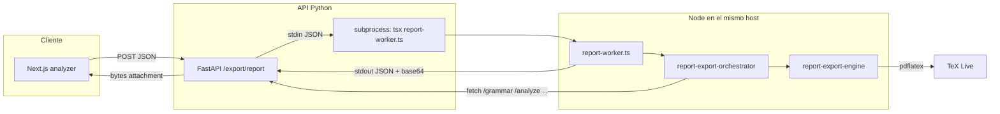

# Infraestructura e implementación de reportes (export)

Este documento describe el flujo extremo a extremo para generar reportes AALIE (Markdown, LaTeX, PDF y ZIP), los paquetes del monorepo, la imagen Docker de la API y las dependencias de sistema y Node.

> **Nota:** Los bloques de código siguientes son copias del repositorio para lectura offline. Si algo no cuadra con el comportamiento real, prevalece el código en el árbol de fuentes.

## Visión general

1. **Cliente (Next.js)** — El analizador llama por HTTP a la API FastAPI (`POST /export/report`) con el cuerpo JSON (código fuente, formatos, locale, opciones de traza, etc.).
2. **API (Python)** — Valida el payload, opcionalmente inyecta `requestOrigin` desde cabeceras, y ejecuta un **subproceso Node** con `tsx` sobre el worker TypeScript.
3. **Worker (`report-worker.ts`)** — Lee JSON por stdin, invoca el orquestador y escribe **solo JSON** en stdout (éxito con `contentBase64`, o error estructurado).
4. **Orquestador (`@aa/report-export-orchestrator`)** — Obtiene artefactos de análisis (parse, classify, analyze, trace…) vía HTTP contra la misma API, construye el **snapshot** y delega en el motor.
5. **Motor (`@aa/report-export-engine`)** — Construye el modelo de documento, renderiza Markdown/LaTeX, compila PDF con **pdflatex** si aplica, empaqueta ZIP y devuelve buffers.



## `package.json` de los paquetes de export

### `packages/report-export-orchestrator/package.json`

```json
{
  "name": "@aa/report-export-orchestrator",
  "version": "0.1.0",
  "private": true,
  "type": "module",
  "description": "Server-side export service for AALIE reports (Markdown/LaTeX/PDF + ZIP).",
  "main": "index.ts",
  "types": "index.ts",
  "exports": {
    ".": {
      "import": "./index.ts",
      "require": "./index.ts",
      "types": "./index.ts"
    }
  },
  "scripts": {
    "build": "tsc -p tsconfig.json --noEmit",
    "test": "echo \"no tests yet\""
  },
  "dependencies": {
    "@aa/report-export-engine": "workspace:^",
    "@aa/types": "workspace:^",
    "tsx": "^4.21.0"
  },
  "devDependencies": {
    "@types/node": "20.14.9",
    "typescript": "5.5.4"
  },
  "engines": {
    "node": ">=20 <23"
  }
}
```

### `packages/report-export-engine/package.json`

```json
{
  "name": "@aa/report-export-engine",
  "version": "0.1.0",
  "private": true,
  "type": "module",
  "description": "Motor de exportación de reportes AALIE (Markdown, LaTeX, PDF) + bundling",
  "main": "index.ts",
  "types": "index.ts",
  "exports": {
    ".": {
      "import": "./index.ts",
      "require": "./index.ts",
      "types": "./index.ts"
    }
  },
  "scripts": {
    "build": "tsc -p tsconfig.json --noEmit",
    "test": "node --import tsx --test --test-reporter=spec src/__tests__/*.test.ts",
    "test:tap": "node --import tsx --test src/__tests__/*.test.ts",
    "golden:refresh": "node --import tsx src/examples/refresh-golden-text.ts",
    "golden:pdf": "node --import tsx src/examples/export-golden-pdfs.ts"
  },
  "dependencies": {
    "@aa/types": "workspace:^",
    "dagre": "^0.8.5",
    "jszip": "^3.10.1",
    "pdfkit": "^0.15.0",
    "svg-to-pdfkit": "^0.1.8"
  },
  "devDependencies": {
    "@types/dagre": "^0.7.53",
    "@types/node": "20.14.9",
    "@types/pdfkit": "^0.17.3",
    "tsx": "^4.21.0",
    "typescript": "5.5.4"
  },
  "engines": {
    "node": ">=20 <23"
  }
}
```

| Dependencia | Uso |
|-------------|-----|
| **`dagre`** | Layout de grafos para diagramas de traza. |
| **`jszip`** | Bundle `.zip` con artefactos. |
| **`pdfkit`** + **`svg-to-pdfkit`** | SVG de traza → PDF auxiliar para LaTeX. |
| **`tsx`** | Ejecutar TypeScript del worker. |

El `pnpm install` en Docker usa `--filter @aa/report-export-orchestrator...` para traer el orquestador **y** dependencias del workspace (motor, types, npm transitivas).

## API FastAPI: registro, CORS y router de export

### `apps/api/app/main.py`

```python
"""
Punto de entrada principal de la aplicación FastAPI.

Configura la aplicación FastAPI, middlewares (CORS por entorno),
y registra los routers de los módulos principales.

Author: Juan Felipe Henao (@Pipe-1z)
"""

import os

from dotenv import load_dotenv
from fastapi import FastAPI
from fastapi.middleware.cors import CORSMiddleware
from fastapi.responses import JSONResponse

from .core.config import get_cors_allowed_origins, get_cors_enabled
from .modules.analysis.router import router as analyze_router
from .modules.classification.router import router as classify_router
from .modules.export.router import router as export_router
from .modules.parsing.router import router as parse_router

# Cargar variables de entorno desde .env
env_path = os.path.join(os.path.dirname(os.path.dirname(__file__)), ".env")


def create_app() -> FastAPI:
    load_dotenv(env_path)

    app = FastAPI(title="algorithmic-analysis API", version="0.1.0")

    # --- CORS configurado por entorno ---
    if get_cors_enabled():
        app.add_middleware(
            CORSMiddleware,
            allow_origins=get_cors_allowed_origins(),
            allow_credentials=False,
            allow_methods=["*"],
            allow_headers=["*"],
            expose_headers=["Content-Disposition", "X-Snapshot-Id", "X-Content-Hash"],
            max_age=600,
        )

    # --- Rutas ---
    @app.get("/health")
    def health():
        """
        Endpoint de health check para verificar el estado del servidor.

        Returns:
            JSONResponse con {"status": "ok"}

        Author: Juan Felipe Henao (@Pipe-1z)
        """
        # Respeta tu forma actual (JSON con {"status":"ok"})
        return JSONResponse({"status": "ok"})

    app.include_router(parse_router)
    app.include_router(analyze_router)
    app.include_router(classify_router)
    app.include_router(export_router)

    return app


app = create_app()
```

### `apps/api/app/core/config.py` (CORS)

```python
"""
Módulo de configuración core para la aplicación.

Author: Juan Felipe Henao (@Pipe-1z)
"""

import os

DEFAULT_ALLOWED_ORIGINS = ["http://localhost:3000", "http://127.0.0.1:3000"]


def _as_bool(value: str) -> bool:
    """
    Convierte un string a booleano.

    Args:
        value: String a convertir (acepta "1", "true", "yes", "y", "on" para True)

    Returns:
        True si el valor representa verdadero, False en caso contrario

    Author: Juan Felipe Henao (@Pipe-1z)
    """
    return value.strip().lower() in {"1", "true", "yes", "y", "on"}


def get_dev_cors_enabled() -> bool:
    """
    Obtiene si CORS está habilitado en modo desarrollo.

    Por defecto está habilitado (retorna True si la variable de entorno
    DEV_CORS_ENABLED no está definida o está en un valor "truthy").

    Returns:
        True si CORS está habilitado, False en caso contrario

    Author: Juan Felipe Henao (@Pipe-1z)
    """
    # Por defecto lo dejamos encendido en dev
    return _as_bool(os.getenv("DEV_CORS_ENABLED", "1"))


def get_cors_enabled() -> bool:
    """
    Habilita CORS en cualquier ambiente.

    - Si `CORS_ENABLED` está definida, se usa.
    - Si no, se mantiene compatibilidad con `DEV_CORS_ENABLED`.
    """

    return _as_bool(os.getenv("CORS_ENABLED", os.getenv("DEV_CORS_ENABLED", "1")))


def _parse_allowed_origins(raw: str) -> list[str]:
    raw = (raw or "").strip()
    if raw == "*":
        return ["*"]
    items = [s.strip() for s in raw.split(",") if s.strip()]
    return items


def get_dev_allowed_origins() -> list[str]:
    """
    Obtiene los orígenes permitidos para CORS en modo desarrollo.

    Si la variable de entorno DEV_ALLOWED_ORIGINS está definida y contiene valores,
    se usan esos valores separados por comas. Si no, se usan valores por defecto:
    ["http://localhost:3000", "http://127.0.0.1:3000"]

    Returns:
        Lista de strings con los orígenes permitidos

    Author: Juan Felipe Henao (@Pipe-1z)
    """
    raw = os.getenv("DEV_ALLOWED_ORIGINS", "")
    items = _parse_allowed_origins(raw)
    return items if items else DEFAULT_ALLOWED_ORIGINS


def get_cors_allowed_origins() -> list[str]:
    """
    Orígenes permitidos para CORS.

    - Primero intenta `CORS_ALLOWED_ORIGINS`.
    - Si no está, intenta `DEV_ALLOWED_ORIGINS`.
    - Si no hay ninguno definido, usa los orígenes de desarrollo por defecto.
    - El wildcard (`*`) solo se habilita si se configura explícitamente.
    """

    raw = (
        os.getenv("CORS_ALLOWED_ORIGINS")
        or os.getenv("DEV_ALLOWED_ORIGINS")
        or ",".join(DEFAULT_ALLOWED_ORIGINS)
    )
    items = _parse_allowed_origins(raw)
    return items if items else DEFAULT_ALLOWED_ORIGINS
```

### `apps/api/app/modules/export/router.py` (completo)

```python
"""
Export router.

Provides an endpoint for generating report artifacts (Markdown/PDF/ZIP) on the backend.
"""

from __future__ import annotations

import base64
import json
import os
import subprocess
from typing import Any, Dict, Optional

from fastapi import APIRouter, Body, Request
from fastapi.responses import Response

router = APIRouter(prefix="/export", tags=["export"])


def _node_worker_path() -> str:
    """
    Returns the path to the Node worker script.

    Note: the worker is implemented in a later plan step.
    """

    # apps/api/app/modules/export/router.py -> packages/report-export-orchestrator/src/report-worker.ts
    return os.path.abspath(
        os.path.join(
            os.path.dirname(__file__),
            "../../../../../packages/report-export-orchestrator/src/report-worker.ts",
        )
    )


def _run_export_worker(payload: Dict[str, Any]) -> Dict[str, Any]:
    worker_path = _node_worker_path()
    # Ejecutamos el worker desde el paquete del orquestador para que el archivo y sus
    # dependencias de workspace (`@aa/*`) se resuelvan desde el mismo árbol de Node.
    repo_root = os.path.abspath(
        os.path.join(os.path.dirname(__file__), "../../../../../")
    )
    cwd = os.path.join(repo_root, "packages", "report-export-orchestrator")
    tsx_bin = os.path.join(cwd, "node_modules", ".bin", "tsx")

    # Ejecutamos el worker con el CLI de `tsx` para respetar ESM y la resolución de `exports`.
    cmd = (
        [tsx_bin, worker_path]
        if os.path.exists(tsx_bin)
        else ["node", "--import", "tsx", worker_path]
    )

    proc = subprocess.run(
        cmd,
        input=json.dumps(payload),
        capture_output=True,
        check=False,
        text=True,
        cwd=cwd,
    )

    if proc.returncode != 0:
        return {
            "ok": False,
            "error": "Export worker failed",
            "kind": "worker_failed",
            "logs": (proc.stderr or "").splitlines(),
            "status": 500,
        }

    try:
        parsed = json.loads(proc.stdout)
        if not parsed or not isinstance(parsed, dict):
            raise ValueError("Empty worker response")
        return parsed
    except Exception:
        return {
            "ok": False,
            "error": "Export worker returned invalid JSON",
            "kind": "worker_invalid_response",
            "logs": [(proc.stdout or "")[-4000:], (proc.stderr or "")[-4000:]],
            "status": 500,
        }


@router.post("/report")
def export_report(request: Request, payload: Dict[str, Any] = Body(...)) -> Response:
    source = str(payload.get("source") or "")
    if not source.strip():
        return Response(
            content=json.dumps({"ok": False, "error": "Field 'source' is required."}),
            status_code=400,
            media_type="application/json",
        )

    try:
        # Ensure we pass an origin so llm/compare (if enabled later) can still reach Next proxies.
        origin = request.headers.get("origin") or request.headers.get("referer")
        if origin and not payload.get("requestOrigin"):
            payload["requestOrigin"] = origin

        result = _run_export_worker(payload)
    except Exception as e:
        return Response(
            content=json.dumps(
                {
                    "ok": False,
                    "error": str(e),
                }
            ),
            status_code=500,
            media_type="application/json",
        )

    if not result.get("ok"):
        # Expected structure:
        # { ok:false, error, kind?, logs?, status? }
        error_message = str(result.get("error") or "Export failed")
        kind = result.get("kind")
        logs = result.get("logs")
        body: Dict[str, Any] = {"ok": False, "error": error_message}
        if kind:
            body["kind"] = kind
        if isinstance(logs, str):
            body["logs"] = logs[-4000:]
        elif isinstance(logs, list):
            body["logs"] = logs[-4000:]
        return Response(
            content=json.dumps(body),
            status_code=500,
            media_type="application/json",
        )

    mime_type: str = str(result["mimeType"])
    filename: str = str(result["filename"])
    content_b64: str = str(result["contentBase64"])

    content_bytes = base64.b64decode(content_b64)

    headers: Dict[str, str] = {
        "Content-Type": mime_type,
        "Content-Disposition": f'attachment; filename="{filename}"',
    }

    snapshot_id: Optional[str] = result.get("snapshotId")
    content_hash: Optional[str] = result.get("contentHash")
    if snapshot_id:
        headers["X-Snapshot-Id"] = snapshot_id
    if content_hash:
        headers["X-Content-Hash"] = content_hash

    return Response(content=content_bytes, status_code=200, headers=headers)
```

## Worker Node: `packages/report-export-orchestrator/src/report-worker.ts` (completo)

```typescript
import { LatexCompilationError } from "@aa/report-export-engine";
import type { ExportArtifact } from "@aa/report-export-engine";

import { createReportFromSource, type ExportReportRequest } from "./export-service";

function readStdinJson(): Promise<unknown> {
  return new Promise((resolve, reject) => {
    let raw = "";
    process.stdin.setEncoding("utf8");
    process.stdin.on("data", (chunk) => {
      raw += chunk;
    });
    process.stdin.on("end", () => {
      try {
        resolve(raw ? JSON.parse(raw) : null);
      } catch (e) {
        reject(e);
      }
    });
    process.stdin.on("error", (e) => reject(e));
  });
}

function toContentBytes(content: string | Buffer): Buffer {
  return Buffer.isBuffer(content) ? content : Buffer.from(content, "utf8");
}

async function main() {
  const parsed = await readStdinJson();
  const payload = (parsed || {}) as Partial<ExportReportRequest>;

  const source = String(payload.source || "");
  if (!source.trim()) {
    process.stdout.write(
      JSON.stringify({ ok: false, error: "Field 'source' is required." }),
    );
    process.exit(0);
  }

  try {
    const result = await createReportFromSource({
      ...(payload as ExportReportRequest),
      source,
    });

    const isBundle = !!result.bundle;
    const outputMatch = result.bundle || result.artifacts[0];
    if (!outputMatch) {
      throw new Error("No artifacts were generated.");
    }

    const mimeType = isBundle
      ? "application/zip"
      : (outputMatch as ExportArtifact).mimeType;
    const filename = outputMatch.filename;
    const content = toContentBytes(outputMatch.content);

    const response = {
      ok: true,
      mimeType,
      filename,
      contentBase64: content.toString("base64"),
      snapshotId: result.snapshot.snapshotId,
      contentHash: result.snapshot.contentHash,
    };

    process.stdout.write(JSON.stringify(response));
  } catch (error) {
    if (error instanceof LatexCompilationError) {
      process.stdout.write(
        JSON.stringify({
          ok: false,
          error: error.message,
          kind: error.kind,
          logs: error.logs,
        }),
      );
      process.exit(0);
    }

    process.stdout.write(
      JSON.stringify({
        ok: false,
        error: error instanceof Error ? error.message : String(error),
      }),
    );
    process.exit(0);
  }
}

main().catch((e) => {
  process.stdout.write(
    JSON.stringify({ ok: false, error: e instanceof Error ? e.message : String(e) }),
  );
  process.exit(0);
});
```

## Orquestador: `packages/report-export-orchestrator/src/export-service.ts` (completo)

```typescript
import type {
  BuildExportReportResult,
  BuildSnapshotInput,
  ExportFormat,
} from "@aa/report-export-engine";
import {
  assertValidSnapshot,
  buildExportReport,
  buildSnapshot,
} from "@aa/report-export-engine";
import type {
  AalieAnalysisSnapshotV1,
  SnapshotCase,
  SnapshotRecursiveMethod,
  SnapshotSourceOrigin,
} from "@aa/types";

import {
  collectArtifactsForSnapshot,
  type CollectArtifactsInput,
} from "./collect-artifacts";

const DEFAULT_FORMATS: ExportFormat[] = ["markdown", "latex"];

export interface ExportSnapshotRequest {
  source: string;
  locale?: string;
  sourceOrigin?: SnapshotSourceOrigin;
  analysisId?: string;
  includeTraceCases?: SnapshotCase[];
  includeLlm?: boolean;
  llmPayload?: unknown;
  includeGpuCpu?: boolean;
  preferredMethod?: SnapshotRecursiveMethod;
  algorithmKind?: "iterative" | "recursive" | "hybrid" | "dummy" | "unknown";
  apiKey?: string;
  requestOrigin?: string;
  cachedParse?: BuildSnapshotInput["parse"];
  cachedClassify?: BuildSnapshotInput["classify"];
  cachedAnalyze?: BuildSnapshotInput["analyze"];
  cachedTraceByCase?: BuildSnapshotInput["traceByCase"];
}

export interface ExportReportRequest extends ExportSnapshotRequest {
  formats?: ExportFormat[];
  includeSnapshotJson?: boolean;
  includeZipBundle?: boolean;
  pdfTimeoutMs?: number;
}

function normalizeLocale(locale: string | undefined): "es" | "en" {
  return String(locale || "en").toLowerCase().startsWith("es") ? "es" : "en";
}

function normalizeTraceCases(cases: unknown): SnapshotCase[] | undefined {
  if (!Array.isArray(cases) || cases.length === 0) {
    return undefined;
  }
  const normalized = cases.filter(
    (item): item is SnapshotCase => item === "worst" || item === "best" || item === "avg",
  );
  return normalized.length > 0 ? Array.from(new Set(normalized)) : undefined;
}

function normalizeFormats(formats: unknown): ExportFormat[] {
  if (!Array.isArray(formats) || formats.length === 0) {
    return DEFAULT_FORMATS;
  }
  const normalized = formats.filter(
    (item): item is ExportFormat =>
      item === "markdown" || item === "latex" || item === "pdf",
  );
  return normalized.length > 0 ? Array.from(new Set(normalized)) : DEFAULT_FORMATS;
}

function toCollectInput(input: ExportSnapshotRequest): CollectArtifactsInput {
  return {
    source: input.source,
    locale: normalizeLocale(input.locale),
    sourceOrigin: input.sourceOrigin,
    analysisId: input.analysisId,
    includeTraceCases: normalizeTraceCases(input.includeTraceCases),
    includeLlm: input.includeLlm,
    llmPayload: input.llmPayload,
    includeGpuCpu: input.includeGpuCpu,
    preferredMethod: input.preferredMethod,
    algorithmKindHint: input.algorithmKind,
    apiKey: input.apiKey,
    requestOrigin: input.requestOrigin,
    cachedParse: input.cachedParse,
    cachedClassify: input.cachedClassify,
    cachedAnalyze: input.cachedAnalyze,
    cachedTraceByCase: input.cachedTraceByCase,
  };
}

export async function createSnapshotFromSource(
  input: ExportSnapshotRequest,
): Promise<AalieAnalysisSnapshotV1> {
  if (!input.source || !input.source.trim()) {
    throw new Error("Field 'source' is required to create export snapshot.");
  }

  const artifacts = await collectArtifactsForSnapshot(toCollectInput(input));
  const snapshot = buildSnapshot(artifacts);
  assertValidSnapshot(snapshot);
  return snapshot;
}

export async function createReportFromSource(
  input: ExportReportRequest,
): Promise<BuildExportReportResult> {
  const snapshot = await createSnapshotFromSource(input);

  return buildExportReport({
    snapshot,
    formats: normalizeFormats(input.formats),
    includeSnapshotJson: input.includeSnapshotJson ?? true,
    includeZipBundle: input.includeZipBundle ?? true,
    pdf: input.pdfTimeoutMs ? { timeoutMs: input.pdfTimeoutMs } : undefined,
  });
}
```

## Recolección de artefactos vía API: `collect-artifacts.ts` (completo)

```typescript
import type { BuildSnapshotInput } from "@aa/report-export-engine";
import type { SnapshotCase, SnapshotRecursiveMethod } from "@aa/types";

import { buildGpuCpuComparative } from "./gpu-cpu-adapter";
import { normalizeLlmComparativePayload, requestLlmComparison } from "./llm-adapter";

type AlgorithmKind = "iterative" | "recursive" | "hybrid" | "dummy" | "unknown";

export interface CollectArtifactsInput {
  source: string;
  locale: "es" | "en";
  sourceOrigin?: BuildSnapshotInput["sourceOrigin"];
  analysisId?: string;
  includeTraceCases?: SnapshotCase[];
  includeLlm?: boolean;
  llmPayload?: unknown;
  includeGpuCpu?: boolean;
  preferredMethod?: SnapshotRecursiveMethod;
  algorithmKindHint?: AlgorithmKind;
  apiKey?: string;
  requestOrigin?: string;
  cachedParse?: BuildSnapshotInput["parse"];
  cachedClassify?: BuildSnapshotInput["classify"];
  cachedAnalyze?: BuildSnapshotInput["analyze"];
  cachedTraceByCase?: BuildSnapshotInput["traceByCase"];
}

function getApiBase(): string {
  const internal = process.env.API_INTERNAL_BASE_URL?.replace(/\/+$/, "");
  if (internal) {
    return internal.startsWith("http://") || internal.startsWith("https://")
      ? internal
      : `https://${internal}`;
  }

  const external = process.env.API_BASE_URL?.replace(/\/+$/, "");
  if (external) {
    return external.startsWith("http://") || external.startsWith("https://")
      ? external
      : `https://${external}`;
  }

  return process.env.DOCKER ? "http://api:8000" : "http://localhost:8000";
}

async function postJson<T>(
  baseUrl: string,
  endpoint: string,
  payload: unknown,
): Promise<T | null> {
  try {
    const response = await fetch(`${baseUrl}${endpoint}`, {
      method: "POST",
      headers: { "Content-Type": "application/json" },
      body: JSON.stringify(payload),
    });
    return (await response.json().catch(() => null)) as T | null;
  } catch {
    return null;
  }
}

function normalizeAlgorithmKind(kind: unknown): AlgorithmKind {
  const normalized = String(kind || "").toLowerCase();
  if (
    normalized === "iterative" ||
    normalized === "recursive" ||
    normalized === "hybrid" ||
    normalized === "dummy"
  ) {
    return normalized;
  }
  return "unknown";
}

function buildTraceInputs(
  source: string,
  caseName: SnapshotCase,
): { inputSize: number; initialVariables: Record<string, unknown> | null } {
  const defaultN = 5;
  const usesX = /(^|[^A-Za-z0-9_])x([^A-Za-z0-9_]|$)/i.test(source);
  const usesArrayA = /(^|[^A-Za-z0-9_])A\s*\[/.test(source);
  const hasZeroCheck =
    /n\s*[=<>]=\s*0|n\s*=\s*0|IF\s*\(\s*n\s*[=<>]=\s*0/i.test(source);
  const isSortingLike =
    /(merge|quick|heap|bubble|insertion|selection|sort|ordenar|mezclar|particionar)/i.test(
      source,
    );

  const n = caseName === "worst" && hasZeroCheck ? 0 : defaultN;
  const safeN = Math.max(1, n);
  const ascArray = Array.from({ length: safeN }, (_, index) => index + 1);
  const descArray = [...ascArray].reverse();
  const selectedArray = isSortingLike
    ? caseName === "best"
      ? ascArray
      : descArray
    : ascArray;

  const variables: Record<string, unknown> = {};
  if (usesArrayA && n > 0) {
    variables.A = selectedArray;
  }

  if (usesX && n > 0) {
    if (caseName === "best") {
      variables.x = selectedArray[0];
    } else if (caseName === "avg") {
      variables.x = selectedArray[Math.floor(selectedArray.length / 2)];
    } else {
      // Worst-case aligned with frontend trace logic: match on the last iteration.
      variables.x = selectedArray[selectedArray.length - 1];
    }
  }

  return {
    inputSize: n,
    initialVariables: Object.keys(variables).length > 0 ? variables : null,
  };
}

export async function collectArtifactsForSnapshot(
  input: CollectArtifactsInput,
): Promise<BuildSnapshotInput> {
  const apiBase = getApiBase();

  const parse = input.cachedParse || await postJson<BuildSnapshotInput["parse"]>(
    apiBase,
    "/grammar/parse",
    {
      source: input.source,
    },
  );

  const classify = input.cachedClassify || await postJson<BuildSnapshotInput["classify"]>(
    apiBase,
    "/classify",
    {
      source: input.source,
    },
  );

  const algorithmKind = normalizeAlgorithmKind(input.algorithmKindHint || classify?.kind);

  const traceCases: SnapshotCase[] =
    input.includeTraceCases && input.includeTraceCases.length > 0
      ? input.includeTraceCases
      : algorithmKind === "iterative" || algorithmKind === "hybrid"
        ? ["worst", "best", "avg"]
        : ["worst"];

  const analyze =
    input.cachedAnalyze ||
    (await postJson<BuildSnapshotInput["analyze"]>(apiBase, "/analyze/open", {
      source: input.source,
      mode: "all",
      avgModel: { mode: "uniform", predicates: {} },
      algorithm_kind: algorithmKind,
      preferred_method: input.preferredMethod,
      locale: input.locale,
    }));

  let detectMethods: BuildSnapshotInput["detectMethods"] = null;
  if (algorithmKind === "recursive" || algorithmKind === "hybrid") {
    detectMethods =
      await postJson<BuildSnapshotInput["detectMethods"]>(
        apiBase,
        "/analyze/detect-methods",
        {
          source: input.source,
          algorithm_kind: algorithmKind,
        },
      );
  }

  const traceByCase: NonNullable<BuildSnapshotInput["traceByCase"]> = input.cachedTraceByCase || {};
  if (!input.cachedTraceByCase) {
    await Promise.all(
      traceCases.map(async (caseName) => {
        const traceInput = buildTraceInputs(input.source, caseName);
        const trace =
          await postJson<NonNullable<BuildSnapshotInput["traceByCase"]>[SnapshotCase]>(
            apiBase,
            "/analyze/trace",
            {
              source: input.source,
              case: caseName,
              input_size: traceInput.inputSize,
              initial_variables: traceInput.initialVariables,
              locale: input.locale,
            },
          );
        traceByCase[caseName] = trace || null;
      }),
    );
  }

  const llmSourcePayload =
    typeof input.llmPayload !== "undefined"
      ? input.llmPayload
      : input.includeLlm
        ? await requestLlmComparison({
            source: input.source,
            locale: input.locale,
            apiKey: input.apiKey,
            requestOrigin: input.requestOrigin,
            analysis: analyze || undefined,
          })
        : null;

  const llm = llmSourcePayload
    ? normalizeLlmComparativePayload(llmSourcePayload)
    : null;

  const gpuCpu =
    input.includeGpuCpu !== false
      ? buildGpuCpuComparative(parse?.ok ? parse.ast : null, input.locale)
      : null;

  return {
    source: input.source,
    locale: input.locale,
    sourceOrigin: input.sourceOrigin,
    analysisId: input.analysisId,
    parse,
    classify,
    analyze,
    detectMethods,
    traceByCase,
    llm,
    gpuCpu,
  };
}
```

## Motor: `packages/report-export-engine/src/application/export-orchestrator.ts` (completo)

```typescript
import type { AalieAnalysisSnapshotV1 } from "@aa/types";

import {
  LATEX_FILENAME,
  MARKDOWN_FILENAME,
  PDF_FILENAME,
} from "../domain/constants";
import { assertValidSnapshot } from "../domain/snapshot-validator";
import { buildDocumentModel, type DocumentModel } from "../renderers/document-model-builder";
import { renderLatexReport } from "../renderers/latex";
import { renderMarkdownReport } from "../renderers/markdown";
import {
  compileLatexToPdf,
  LatexCompilationError,
  type CompileLatexToPdfOptions,
} from "../infrastructure/pdf/latex-compiler";
import { createZipBundle } from "../infrastructure/bundle/zip-bundle";
import { buildTraceDiagramAssets } from "./trace-diagram-assets";

export type ExportFormat = "markdown" | "latex" | "pdf";

export interface ExportArtifact {
  format: ExportFormat | "snapshot" | "asset";
  filename: string;
  mimeType: string;
  content: string | Buffer;
}

export interface BuildExportReportOptions {
  snapshot: AalieAnalysisSnapshotV1;
  formats: ExportFormat[];
  includeSnapshotJson?: boolean;
  includeZipBundle?: boolean;
  documentModel?: DocumentModel;
  pdf?: Omit<CompileLatexToPdfOptions, "texContent">;
}

export interface BuildExportReportResult {
  snapshot: AalieAnalysisSnapshotV1;
  documentModel: DocumentModel;
  artifacts: ExportArtifact[];
  bundle?: {
    filename: string;
    content: Buffer;
  };
}

function normalizeFormats(formats: ExportFormat[]): ExportFormat[] {
  return Array.from(new Set(formats));
}

function artifactMimeType(format: ExportFormat | "snapshot"): string {
  if (format === "markdown") return "text/markdown; charset=utf-8";
  if (format === "latex") return "application/x-tex; charset=utf-8";
  if (format === "pdf") return "application/pdf";
  return "application/json; charset=utf-8";
}

export async function buildExportReport(
  options: BuildExportReportOptions,
): Promise<BuildExportReportResult> {
  assertValidSnapshot(options.snapshot);

  const formats = normalizeFormats(options.formats);
  const model = options.documentModel || buildDocumentModel(options.snapshot);
  const artifacts: ExportArtifact[] = [];
  const traceDiagramAssets = await buildTraceDiagramAssets(model);

  let latexContent: string | null = null;

  if (formats.includes("markdown")) {
    const markdown = renderMarkdownReport({
      snapshot: options.snapshot,
      documentModel: model,
    });

    artifacts.push({
      format: "markdown",
      filename: MARKDOWN_FILENAME,
      mimeType: artifactMimeType("markdown"),
      content: markdown,
    });
  }

  if (formats.includes("latex") || formats.includes("pdf")) {
    latexContent = renderLatexReport({
      snapshot: options.snapshot,
      documentModel: model,
    });

    if (formats.includes("latex")) {
      artifacts.push({
        format: "latex",
        filename: LATEX_FILENAME,
        mimeType: artifactMimeType("latex"),
        content: latexContent,
      });
    }
  }

  if (formats.includes("pdf")) {
    if (!latexContent) {
      throw new Error("LaTeX content was not generated before PDF compilation.");
    }

    try {
      const compiled = compileLatexToPdf({
        texContent: latexContent,
        extraFiles: traceDiagramAssets.map((asset) => ({
          relativePath: asset.filename,
          content: asset.content,
        })),
        ...options.pdf,
      });

      artifacts.push({
        format: "pdf",
        filename: PDF_FILENAME,
        mimeType: artifactMimeType("pdf"),
        content: compiled.pdfBuffer,
      });
    } catch (error) {
      if (error instanceof LatexCompilationError) {
        throw error;
      }
      throw new LatexCompilationError(
        "compilation_failed",
        error instanceof Error ? error.message : String(error),
      );
    }
  }

  if (options.includeSnapshotJson) {
    artifacts.push({
      format: "snapshot",
      filename: "snapshot.json",
      mimeType: artifactMimeType("snapshot"),
      content: JSON.stringify(options.snapshot, null, 2),
    });
  }

  for (const asset of traceDiagramAssets) {
    artifacts.push({
      format: "asset",
      filename: asset.filename,
      mimeType: asset.mimeType,
      content: asset.content,
    });
  }

  if (options.includeZipBundle) {
    const bundle = await createZipBundle(
      artifacts.map((artifact) => ({
        filename: artifact.filename,
        content: artifact.content,
      })),
      {
        snapshotId: options.snapshot.snapshotId,
        contentHash: options.snapshot.contentHash,
        createdAt: options.snapshot.createdAt,
        formats,
      },
    );

    return {
      snapshot: options.snapshot,
      documentModel: model,
      artifacts,
      bundle: {
        filename: bundle.filename,
        content: bundle.buffer,
      },
    };
  }

  return {
    snapshot: options.snapshot,
    documentModel: model,
    artifacts,
  };
}
```

## Diagramas de traza: `trace-diagram-assets.ts` (completo)

```typescript
import type { DocumentModel } from "../renderers/document-model-builder";
import { renderTraceDiagramSvg } from "../infrastructure/diagram/renderTraceDiagramSvg";
import { convertSvgToPdfBuffer } from "../infrastructure/diagram/svg-to-pdf";

export interface TraceDiagramAsset {
  filename: string;
  mimeType: string;
  content: string | Buffer;
}

export async function buildTraceDiagramAssets(model: DocumentModel): Promise<TraceDiagramAsset[]> {
  const assetsByFilename = new Map<string, TraceDiagramAsset>();

  for (const section of model.sections) {
    for (const block of section.blocks) {
      if (block.kind !== "executionTraceDiagram") {
        continue;
      }

      const svgRendered = renderTraceDiagramSvg({
        graph: block.diagram.graph,
        title: block.diagram.title,
        locale: model.locale,
        caseName: model.locale === "es" ? "Peor caso" : "Worst case",
        summary: block.diagram.summary,
        diagnostics: block.diagram.diagnostics,
      });

      assetsByFilename.set(block.diagram.assetSvgPath, {
        filename: block.diagram.assetSvgPath,
        mimeType: "image/svg+xml",
        content: svgRendered.svg,
      });

      const pdfBuffer = await convertSvgToPdfBuffer(svgRendered.svg, {
        width: svgRendered.width,
        height: svgRendered.height,
      });

      assetsByFilename.set(block.diagram.assetPdfPath, {
        filename: block.diagram.assetPdfPath,
        mimeType: "application/pdf",
        content: pdfBuffer,
      });
    }
  }

  return Array.from(assetsByFilename.values()).sort((a, b) => a.filename.localeCompare(b.filename));
}
```

## Compilación PDF: `packages/report-export-engine/src/infrastructure/pdf/latex-compiler.ts` (completo)

```typescript
import { copyFileSync, existsSync, mkdtempSync, readFileSync, rmSync, writeFileSync, mkdirSync } from "node:fs";
import { tmpdir } from "node:os";
import path from "node:path";
import { spawnSync } from "node:child_process";

import { resolveLatexAssetRegistry, type LatexAssetRegistry } from "../assets/asset-registry";

export type LatexCompilationErrorKind = "compiler_missing" | "compilation_failed" | "output_missing";

export class LatexCompilationError extends Error {
  kind: LatexCompilationErrorKind;
  logs: string;

  constructor(kind: LatexCompilationErrorKind, message: string, logs = "") {
    super(message);
    this.name = "LatexCompilationError";
    this.kind = kind;
    this.logs = logs;
  }
}

export interface CompileLatexToPdfOptions {
  texContent: string;
  timeoutMs?: number;
  jobName?: string;
  cleanup?: boolean;
  assets?: LatexAssetRegistry;
  extraFiles?: Array<{
    relativePath: string;
    content: string | Buffer;
  }>;
}

export interface CompileLatexToPdfResult {
  pdfBuffer: Buffer;
  logs: string;
}

export function isPdflatexAvailable(): boolean {
  const command = spawnSync("pdflatex", ["--version"], {
    encoding: "utf8",
  });
  return command.status === 0;
}

function runPdflatexPass(
  workDir: string,
  texFilePath: string,
  timeoutMs: number,
): { status: number | null; output: string } {
  const run = spawnSync(
    "pdflatex",
    [
      "-interaction=nonstopmode",
      "-halt-on-error",
      "-file-line-error",
      path.basename(texFilePath),
    ],
    {
      cwd: workDir,
      encoding: "utf8",
      timeout: timeoutMs,
    },
  );

  const output = `${run.stdout || ""}\n${run.stderr || ""}`;
  return { status: run.status, output };
}

export function compileLatexToPdf(options: CompileLatexToPdfOptions): CompileLatexToPdfResult {
  const timeoutMs = options.timeoutMs ?? 120_000;
  const jobName = options.jobName ?? "report";
  const cleanup = options.cleanup ?? true;

  if (!isPdflatexAvailable()) {
    throw new LatexCompilationError(
      "compiler_missing",
      "pdflatex is not available in the current environment.",
    );
  }

  const assets = options.assets ?? resolveLatexAssetRegistry();
  const workDir = mkdtempSync(path.join(tmpdir(), "aalie-export-"));
  const texFilePath = path.join(workDir, `${jobName}.tex`);
  const logosOutputDir = path.join(workDir, "logos");

  const logs: string[] = [];

  try {
    mkdirSync(logosOutputDir, { recursive: true });

    copyFileSync(assets.styleFilePath, path.join(workDir, "aalie-report.sty"));
    copyFileSync(assets.ucaldasLogoPath, path.join(logosOutputDir, "ucaldas.pdf"));
    copyFileSync(assets.aalieLogoPath, path.join(logosOutputDir, "aalie.pdf"));

    for (const file of options.extraFiles || []) {
      const rel = String(file.relativePath || "").trim().replace(/^\/+/, "");
      if (!rel) continue;
      const dest = path.join(workDir, rel);
      mkdirSync(path.dirname(dest), { recursive: true });
      writeFileSync(dest, file.content);
    }

    writeFileSync(texFilePath, options.texContent, "utf8");

    for (let pass = 1; pass <= 2; pass += 1) {
      const run = runPdflatexPass(workDir, texFilePath, timeoutMs);
      logs.push(`--- pdflatex pass ${pass} ---\n${run.output}`);

      if (run.status !== 0) {
        throw new LatexCompilationError(
          "compilation_failed",
          `pdflatex failed on pass ${pass} with status ${String(run.status)}.`,
          logs.join("\n"),
        );
      }
    }

    const pdfPath = path.join(workDir, `${jobName}.pdf`);
    if (!existsSync(pdfPath)) {
      throw new LatexCompilationError(
        "output_missing",
        `Expected PDF output was not generated at ${pdfPath}.`,
        logs.join("\n"),
      );
    }

    const pdfBuffer = readFileSync(pdfPath);
    return {
      pdfBuffer,
      logs: logs.join("\n"),
    };
  } finally {
    if (cleanup) {
      rmSync(workDir, { recursive: true, force: true });
    }
  }
}
```

## Frontend: llamada al export (`apps/web/src/app/[locale]/analyzer/page.tsx`, fragmento)

```typescript
      const apiBaseUrl = (
        process.env.NEXT_PUBLIC_API_BASE_URL || "http://localhost:8000"
      ).replace(/\/+$/, "");

      const dateStr = new Date().toISOString().slice(0, 10).replace(/-/g, "");
      const procedureName =
        extractProcedureNameFromSource(source) || algorithmType || "algorithm";

      const res = await fetch(`${apiBaseUrl}/export/report`, {
        method: "POST",
        headers: { "Content-Type": "application/json" },
        body: JSON.stringify(reqBody),
      });

      if (!res.ok) throw new Error("Export failed");

      const blob = await res.blob();
      const url = window.URL.createObjectURL(blob);
      const a = document.createElement("a");
      a.href = url;

      if (formats.length > 1) {
        a.download = `${dateStr}-${procedureName}-report.zip`.replaceAll(
          "--",
          "-",
        );
      } else if (formats[0] === "markdown") {
        a.download = `${dateStr}-${procedureName}-report.md`.replaceAll(
          "--",
          "-",
        );
      } else {
        a.download = `${dateStr}-${procedureName}-report.pdf`.replaceAll(
          "--",
          "-",
        );
      }

      document.body.appendChild(a);
      a.click();
      window.URL.revokeObjectURL(url);
      document.body.removeChild(a);
```

El cuerpo `reqBody` se construye más arriba en el mismo handler (incluye `source`, `formats`, cachés opcionales del análisis, etc.).

## Dockerfile de la API: `apps/api/Dockerfile` (completo)

```dockerfile
# syntax=docker/dockerfile:1.7
FROM python:3.11-slim AS base

ENV DEBIAN_FRONTEND=noninteractive \
    PYTHONDONTWRITEBYTECODE=1 \
    PYTHONUNBUFFERED=1 \
    PIP_NO_CACHE_DIR=1 \
    PNPM_HOME=/usr/local/share/pnpm \
    PATH=/usr/local/share/pnpm:$PATH \
    API_INTERNAL_BASE_URL=http://127.0.0.1:8000

# --- System dependencies (TeX + Node toolchain) ---
RUN apt-get update && apt-get install -y --no-install-recommends \
    ca-certificates \
    curl \
    gnupg \
    texlive-latex-base \
    texlive-latex-extra \
    texlive-latex-recommended \
    texlive-pictures \
    texlive-fonts-recommended \
  && rm -rf /var/lib/apt/lists/*

# Node.js (needed by the export worker) — install Node 22 (pnpm/tsx compatible)
RUN curl -fsSL https://deb.nodesource.com/setup_22.x | bash - \
  && apt-get update && apt-get install -y --no-install-recommends nodejs \
  && rm -rf /var/lib/apt/lists/*

# pnpm (monorepo)
RUN corepack enable && corepack prepare pnpm@9.15.0 --activate

# Python dependencies
WORKDIR /usr/src/app/apps/api

COPY packages/grammar/py /usr/src/app/packages/grammar/py
COPY apps/api/requirements.txt /tmp/requirements.txt

RUN python -m pip install --upgrade pip \
  && pip install -r /tmp/requirements.txt

# Node dependencies for the export worker.
# El selector `...` incluye también los workspaces dependientes del orquestador
# (`@aa/report-export-engine`, `@aa/types`) y sus dependencias externas.
WORKDIR /usr/src/app

COPY package.json pnpm-workspace.yaml pnpm-lock.yaml .npmrc .editorconfig ./
COPY apps ./apps
COPY packages ./packages

RUN pnpm install -w --filter @aa/report-export-orchestrator... --frozen-lockfile


FROM base AS dev

COPY apps/api/requirements-dev.txt /tmp/requirements-dev.txt

RUN pip install -r /tmp/requirements-dev.txt

WORKDIR /usr/src/app/apps/api

EXPOSE 8000

CMD ["python", "-m", "uvicorn", "app.main:app", "--host", "0.0.0.0", "--port", "8000", "--reload"]


FROM base AS prod

WORKDIR /usr/src/app/apps/api

EXPOSE 8000

CMD ["python", "-m", "uvicorn", "app.main:app", "--host", "0.0.0.0", "--port", "8000"]
```

Si Babel en la plantilla LaTeX requiere **`spanish.ldf`** y falla en runtime, suele añadirse en la capa `apt` algo como `texlive-lang-spanish` y `texlive-lang-english` (no están en el fragmento anterior).

## Docker Compose local: `infra/docker-compose.yml` (completo)

```yaml
version: "3.9"

services:
  api:
    build:
      context: ..
      dockerfile: apps/api/Dockerfile
      target: dev
    container_name: algoritmos-api
    command: >
      python -m uvicorn app.main:app --host 0.0.0.0 --port 8000 --reload
    ports:
      - "8000:8000"
    environment:
      DEV_CORS_ENABLED: "1"
      DEV_ALLOWED_ORIGINS: "http://localhost:3000,http://127.0.0.1:3000"
      API_INTERNAL_BASE_URL: "http://127.0.0.1:8000"
      PYTHONDONTWRITEBYTECODE: "1"
      PYTHONUNBUFFERED: "1"
    volumes:
      # Monta solo el código de la API para recarga en caliente
      - ../apps/api:/usr/src/app/apps/api
      # Monta packages para acceso a parsers grammar
      - ../packages:/usr/src/app/packages
      # Conserva los node_modules de los paquetes del exportador dentro del contenedor
      - api_export_engine_node_modules:/usr/src/app/packages/report-export-engine/node_modules
      - api_export_orchestrator_node_modules:/usr/src/app/packages/report-export-orchestrator/node_modules

  web:
    build:
      context: ..
      dockerfile: apps/web/Dockerfile
    container_name: algoritmos-web
    depends_on:
      - api
    working_dir: /usr/src/app
    command: >
      sh -c "pnpm install -w &&
             pnpm --filter web dev --port 3000 --hostname 0.0.0.0"
    ports:
      - "3000:3000"
    environment:
        NODE_ENV: development
        NEXT_TELEMETRY_DISABLED: "1"
        NEXT_PUBLIC_API_BASE_URL: "http://localhost:8000"   # para futuras llamadas cliente
        API_INTERNAL_BASE_URL: "http://api:8000"            # usado por /api/health (SSR/proxy)
        WATCHPACK_POLLING: "true"
        # Configuración LLM                       # LOCAL para LM Studio, REMOTE para GitHub Models
        LM_STUDIO_ENDPOINT: "http://host.docker.internal:1234/v1"  # Acceso al host desde Docker
        LM_STUDIO_API_KEY: "lm-studio"                   # Token de GitHub para modo REMOTE
    volumes:
      # Código con hot-reload
      - ../apps/web:/usr/src/app/apps/web
      - ../packages:/usr/src/app/packages
      # Volúmenes para node_modules (no los pises con el bind mount)
      - web_root_node_modules:/usr/src/app/node_modules
      - web_pkg_node_modules:/usr/src/app/apps/web/node_modules

volumes:
  api_export_engine_node_modules:
  api_export_orchestrator_node_modules:
  web_root_node_modules:
  web_pkg_node_modules:
```

## Otros archivos (no pegados aquí)

| Área | Rutas típicas |
|------|----------------|
| Render Markdown/LaTeX | `packages/report-export-engine/src/renderers/markdown/`, `.../latex/` |
| Plantilla y estilo LaTeX | `packages/report-export-engine/assets/latex/` |
| ZIP | `packages/report-export-engine/src/infrastructure/bundle/zip-bundle.ts` |
| Layout diagramas (dagre) | `packages/report-export-engine/src/renderers/shared/trace-diagram-layout.ts`, `.../diagram/` |
| Adaptadores LLM / GPU-CPU | `packages/report-export-orchestrator/src/llm-adapter.ts`, `gpu-cpu-adapter.ts` |

## Documentación relacionada

- `docs/auditoria-implementacion-reports-watermark.md`
- `docs/api/README.md`, `docs/app/api-integration.md`
