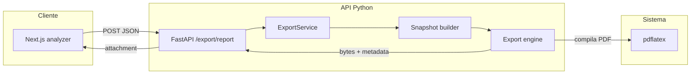

# Infraestructura e implementación de reportes (export)

Este documento describe el flujo vigente para generar reportes AALIE (`.md`, `.tex`, `.pdf` y `.zip`) después de la migración a backend Python puro.

## Visión general

1. **Cliente (Next.js)**: el analizador arma el payload y llama `POST /export/report`.
2. **API (FastAPI)**: valida el request, completa `requestOrigin` si aplica y delega en `ExportService`.
3. **Snapshot builder**: construye un snapshot determinista usando servicios internos de parse, classify, analyze y trace; no hay auto-HTTP al propio backend.
4. **Motor de export**: a partir del mismo snapshot genera el document model, renderiza Markdown/LaTeX, genera assets de diagramas, compila PDF con `pdflatex` y arma el ZIP determinista.
5. **Respuesta HTTP**: devuelve el artefacto final con los mismos headers públicos (`Content-Disposition`, `X-Snapshot-Id`, `X-Content-Hash`).

## Componentes principales

### Backend

- `apps/api/app/modules/export/router.py`
- `apps/api/app/modules/export/service.py`
- `apps/api/app/modules/export/snapshot_builder.py`
- `apps/api/app/modules/export/document_model.py`
- `apps/api/app/modules/export/markdown_renderer.py`
- `apps/api/app/modules/export/latex_renderer.py`
- `apps/api/app/modules/export/trace_diagram.py`
- `apps/api/app/modules/export/trace_diagram_assets.py`
- `apps/api/app/modules/export/latex_compiler.py`
- `apps/api/app/modules/export/zip_bundle.py`
- `apps/api/app/modules/export/assets/latex/`

### Contrato de salida

- Formatos soportados por API: `markdown`, `latex`, `pdf`
- Nombres de archivo canónicos: `report.md`, `report.tex`, `report.pdf`, `snapshot.json`, `manifest.json`
- Headers públicos:
  - `Content-Disposition`
  - `X-Snapshot-Id`
  - `X-Content-Hash`
- Orden del ZIP:
  1. `report.md`
  2. `report.tex`
  3. `report.pdf`
  4. `snapshot.json`
  5. `assets/**` en orden léxico
  6. `manifest.json`

## Dependencias de sistema

La imagen de la API ya no instala Node ni `pnpm` para export. El runtime de export depende de:

- Python
- `reportlab`
- `pdflatex`
- paquetes TeX necesarios para la plantilla:
  - `texlive-latex-base`
  - `texlive-latex-extra`
  - `texlive-latex-recommended`
  - `texlive-pictures`
  - `texlive-fonts-recommended`
  - `texlive-lang-english`
  - `texlive-lang-spanish`

## Estado actual

- El frontend está en modo descarga-only para export.
- El backend de export ya no usa `tsx`, workers Node ni subprocesses TypeScript.
- Los assets LaTeX viven en el backend.
- Los tests de export viven en `apps/api/tests/unit/export/` y `apps/api/tests/system/test_export_endpoint.py`.
